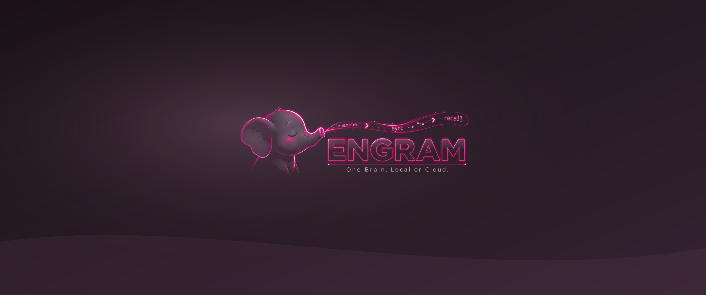

# Gentleman Theme Sexy

A modern Omarchy color theme with the shared Cute Gentle AI and Engram wallpapers.

## Wallpaper previews

These shared Cute wallpaper artwork previews are pending separate Sexy artwork. They are not app coverage or full desktop screenshots.

### Gentle AI


[3440×1440 PNG](backgrounds/gentle-ai-3440x1440.png) · [3840×2160 PNG](backgrounds/gentle-ai-3840x2160.png)

### Engram



[3440×1440 PNG](backgrounds/engram-3440x1440.png) · [3840×2160 PNG](backgrounds/engram-3840x2160.png)

## Install

> **Warning:** this command installs and activates the theme.

```sh
omarchy theme install https://github.com/kattsushi/omarchy-gentleman-theme-sexy
```

To select it manually later:

```sh
omarchy theme set gentleman-theme-sexy
```

Omarchy generates its supported terminal configuration from `colors.toml`.
This repository bundles no terminal configuration, Foot background, theme-set hook,
bar, lock-screen, screensaver, Gentle Pi dependency, or installer behavior.

## License and marks

Copyright 2026 Andres David Jimenez. The original theme arrangement and documentation
in this repository are MIT-licensed. Third-party logos and marks are not licensed
under MIT and no trademark rights are granted; see [ATTRIBUTION.md](ATTRIBUTION.md).
